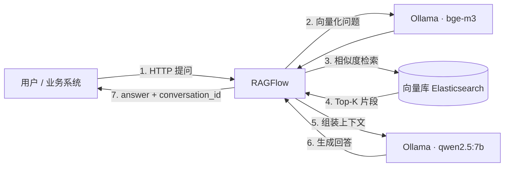

# Local AI Knowledge Base · 本地私有 AI 知识库（RAGFlow 主线）

> 基于 **Linux + Docker + Ollama + RAGFlow（对比：Dify）** 从零搭建的**全本地私有知识库（RAG）**教程式开源项目。
> 让大模型回答你自己公司的文档，并把问答能力封装成 **Web API** 给业务系统调用。推理与检索全部在内网完成，业务数据不出服务器，无需任何云 API Key。

本仓库完整链路：

```
Linux 服务器 → Docker → Ollama → 本地大模型(qwen2.5:7b) + Embedding(bge-m3)
    → 向量检索(Elasticsearch) → RAGFlow（知识库问答）→ Web API → 业务系统
```

---

## ✨ 核心特点

- **完全本地 / 可离线**：对话模型与向量模型都由本地 Ollama 提供，文档不离开内网
- **中文 RAG 全链路可复现**：切块 → 向量化入库 → 检索 → 生成，每步都有命令与预期结果
- **双平台对比**：主线路 RAGFlow（知识库/RAG 能力更强）；Dify 作为「路线 B 对比」保留完整部署与 API 验证记录
- **安全规范**：仓库内不出现真实 IP 与密钥，全部使用 `<SERVER_IP>`、`<APP_API_KEY>` 占位符

## ✅ 已验证进度（以本教程实测为准）

| 环节 | 状态 | 说明 |
|---|---|---|
| Docker + Ollama + qwen2.5:7b / bge-m3 | ✅ 实测通过 | 10G 内存 Linux 服务器 |
| Dify 全链路（UI + Web API + 多轮会话） | ✅ 实测通过 | 见路线 B |
| RAGFlow 部署 + 知识库解析 + UI 问答 | ✅ 实测通过 | 主线 |
| RAGFlow 服务 API 接入业务系统 | ✅ 实测通过 | 主线 |

## 🏗 架构总览



> 各层职责、为什么这样分层、和 Dify 的差异见 [docs/01-architecture.md](docs/01-architecture.md)

## 🚀 快速开始

```bash
# 1. 准备 Linux + Docker（见 docs/02-environment-prep.md）
# 2. 启动 Ollama 并拉取模型 qwen2.5:7b + bge-m3（见 docs/03-ollama-models.md）
# 3. 部署 RAGFlow、建知识库、导入示例文档、创建问答应用（见 docs/04-ragflow-mainline.md）
# 4. 打通 Web API / 业务系统接入（见 docs/05-web-api.md、docs/06-business-integration.md）
# 路线 B（Dify 对比）见 docs/07-route-b-dify.md
```

## 📂 项目结构

```
.
├── README.md                  # 本文件：项目说明 + 快速导航
├── LICENSE                    # MIT
├── docs/                      # 教程文档（从 0 到 Web API 的分步指南）
│   ├── 01-architecture.md     #   架构与组件关系
│   ├── 02-environment-prep.md #   Linux + Docker 环境准备
│   ├── 03-ollama-models.md    #   Ollama + 对话/Embedding 模型
│   ├── 04-ragflow-mainline.md #   主线：RAGFlow 部署 + 知识库 + 问答
│   ├── 05-web-api.md          #   打通 Web API（curl 验证）
│   ├── 06-business-integration.md # 业务系统接入示例
│   ├── 07-route-b-dify.md     #   路线 B：Dify 对比
│   ├── 08-troubleshooting-faq.md # 故障排查与 FAQ
│   └── 09-interview-guide.md  #   面试讲解口径
├── example-data/              # 示例业务文档（虚构“星火智造”）
├── api-examples/              # curl / Python 调用示例（占位符）
├── deploy/                    # 部署用模板（.env 补丁、内存优化说明）
├── scripts/                   # 一键巡检脚本
├── web-demo/                  # 业务系统接入示例（网页对话框 demo）
└── .gitignore
```


## ⚠️ 安全与许可

- 教程中的 IP、端口、密钥均为占位符，使用前替换为你自己的环境
- API 密钥等敏感信息严禁提交到仓库（用环境变量 + `.env.example`，`.gitignore` 已屏蔽）
- 示例业务文档为虚构内容（星火智造），请勿直接使用真实公司资料
- 本仓库 MIT 许可；依赖开源项目：Ollama(MIT)、Dify(Apache-2.0)、RAGFlow(Apache-2.0)、Elasticsearch(SSPL/Elastic License)