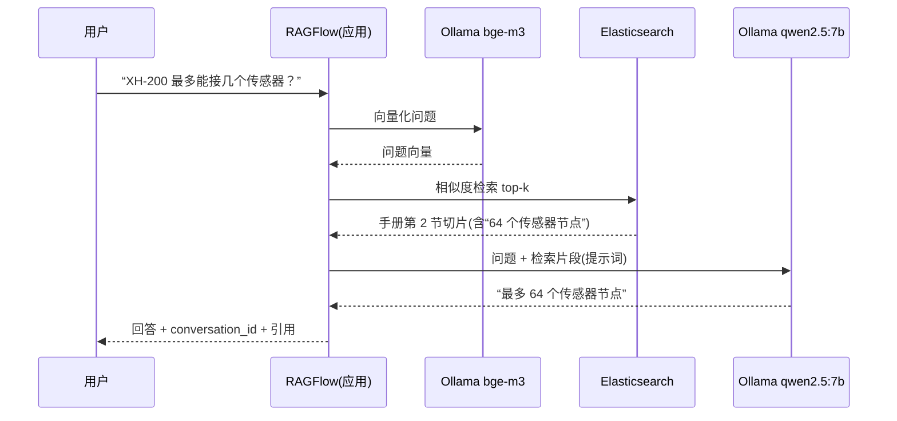

# 01 · 架构与组件关系

> 本文回答三个问题：每一层是什么？谁依赖谁？一次问答的数据是怎么流动的？

## 1. 分层结构

| 层级 | 组件 | 职责 |
|---|---|---|
| 底座 | Linux + Docker | 所有服务以容器方式运行，一键启停、互不污染 |
| 模型服务 | Ollama | 本地模型运行时，提供 OpenAI 风格的本地 API |
| 生成模型 | qwen2.5:7b | 理解问题、依据检索到的资料生成回答（LLM） |
| Embedding 模型 | bge-m3 | 把文字转成向量（语义指纹），用于检索匹配 |
| 向量存储 | Elasticsearch（RAGFlow 内置） | 存向量 + 做相似度检索 |
| 应用平台 | RAGFlow（主线）/ Dify（路线 B） | 知识库管理、切块、应用编排、Web API、密钥 |
| 调用方 | 业务系统 / web-demo | 通过 HTTP 调用平台的对话 API |

## 2. 谁依赖谁

```
业务系统 → 应用平台(RAGFlow/Dify) → Ollama(qwen 生成 / bge-m3 向量化)
                                └→ 向量库(ES)  ←（存知识库切片与向量）
```

RAGFlow 与 Dify 是同类型产品（应用/知识库平台），**不是前后依赖关系**，二选一即可，且都能对接同一个 Ollama。

## 3. RAG 的两条流水线

入库（一次性，把业务文档变成可检索的知识）：
```text
文档 → 切块(chunk) → bge-m3 向量化 → 写入 Elasticsearch
```

问答（每次提问都走一遍）：
```text
用户问题
  → bge-m3 把问题向量化
  → ES 相似度检索 Top-K 片段
  → (可选 rerank 重排精化)
  → 把「问题 + 检索到的片段」组装成提示词交给 qwen2.5:7b
  → 生成回答 → 返回 answer（附引用来源）
```

> rerank（重排）是可选的精度优化：把粗召回结果精排一遍，让最相关片段排更前。Ollama 不提供 rerank 模型，课程主线先跳过，进阶再考虑 TEI + bge-reranker（10G 内存机器不建议同机跑）。

## 4. 一次问答的真实数据流（以 XH-200 为例）



## 5. 为什么这样设计

- **数据不出内网**：推理、向量化、检索全在本地完成，隐私与合规可控
- **解耦**：Ollama 只提供“模型能力”，平台只做“知识 + 编排”，换模型/换平台互不影响
- **RAG 解决幻觉**：模型不靠“背”，而是每次现查资料再回答，答案可追溯

## 6. 安全边界

- 所有 API Key 保存在后端/环境变量，前端不直接持有
- 平台开放端口仅限内网；如需公网访问务必加网关鉴权（生产建议）
